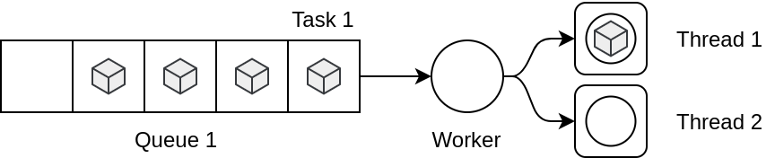
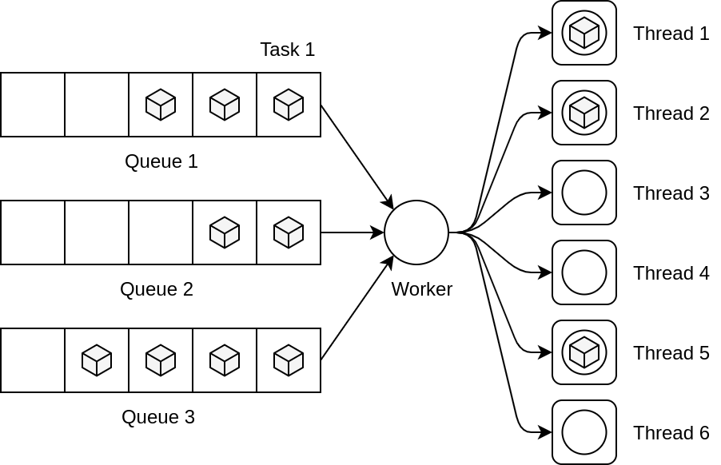

# Balanceador

Nos encontramos en un sistema donde un servicio denominado **trabajador** tiene la tarea de distribuir desde varias **colas** de tareas a un pool de **hilos**.

El trabajador selecciona una de las tareas en cabeza de las colas que tiene disponible, una vez seleccionada es enviada a uno de los hilos que están disponibles (y no ocupados). Una vez enviado, el trabajador comienza de nuevo a seleccionar nuevas tareas, mientras en el servidor ejecuta la tarea enviada, cuando acaba de ejecutarse la tarea se desaloja y queda libre para una nueva.

Todas estas acciones se desarrollan hasta que no quede ninguna tarea pendiente de ejecutar. El envío de tareas desde el trabajador hasta el hilo tiene un duración que depende de la **velocidad de trasferencia** disponible y el **tamaño de la tarea** (bytes de código), así mismo la ejecución de cada tarea en los hilos tiene una **duración estimada de ejecución** por cada tarea.

El objetivo es generar un plan **minimice el tiempo de ejecución** de cada hilo, para así optimizar el tiempo que tarde todo el proceso.

Los objetos que se deberán declarar en el fichero del problema.

```
(:objects task queue thread worker)
```

Las acciones a modelizar serán:

- el trabajador de la cabeza de cada cosa asiganada **seleccione** una tarea y la envíe a un hilo disponible
- el hilo **ejecute** la tarea y la desaloje quedando libre nuevamente

## Problema 1

Se desarrollará un primer problema con los siguientes componentes, el número de tareas se deja a elección.

<p align="center">
  
</p>

## Problema 2

Un segundo problema evaluando múltiples colas e hilos de ejecución, el número de tareas se deja a elección.

<p align="center">
  
</p>
